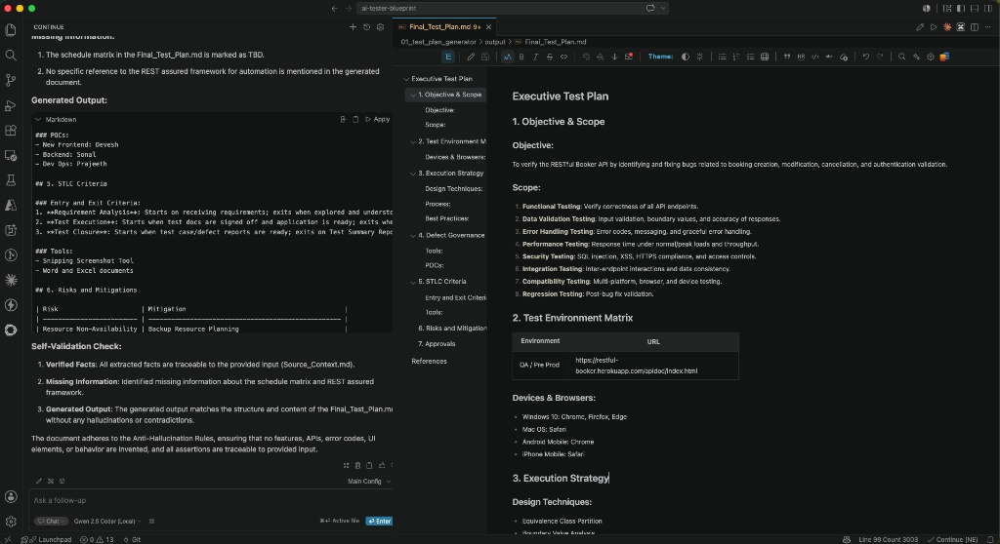

# Module 01: AI-Driven Test Plan Generator

This module focuses on leveraging local Large Language Models (LLMs) alongside advanced prompt engineering frameworks to parse raw project documentation and generate production-grade, hallucination-free test plans.

## 🛠️ Architecture & Core Mechanics

* **RICE-POT Prompting Framework:** Structured configuration blocks mapping out the explicit *Role, Instructions, Context, Examples, Parameters, Output,* and *Tone* sent to the model.
* **Anti-Hallucination Guardrails:** An audit layer driven by strict verification rulesets to guarantee zero default template fluff and complete data traceability.

## 💻 Tech Stack

* **Local LLM Engine:** Ollama running `qwen2.5-coder:14b`
* **IDE Integration:** Continue.dev extension inside Visual Studio Code
* **Target Domain:** Restful Booker CRUD API (POST, GET, PUT, DELETE)

## 📸 Execution Verification Preview

The following screenshot demonstrates the local generation and quality audit interface operating flawlessly within VS Code via Continue.dev and `qwen2.5-coder:14b`:

## 📜 Credits

* **Anti-Hallucination Framework:** Pramod Dutta (Principal SDET, The Testing Academy)
* **Powered by:** Ollama (`qwen2.5-coder:14b`) & Continue.dev
