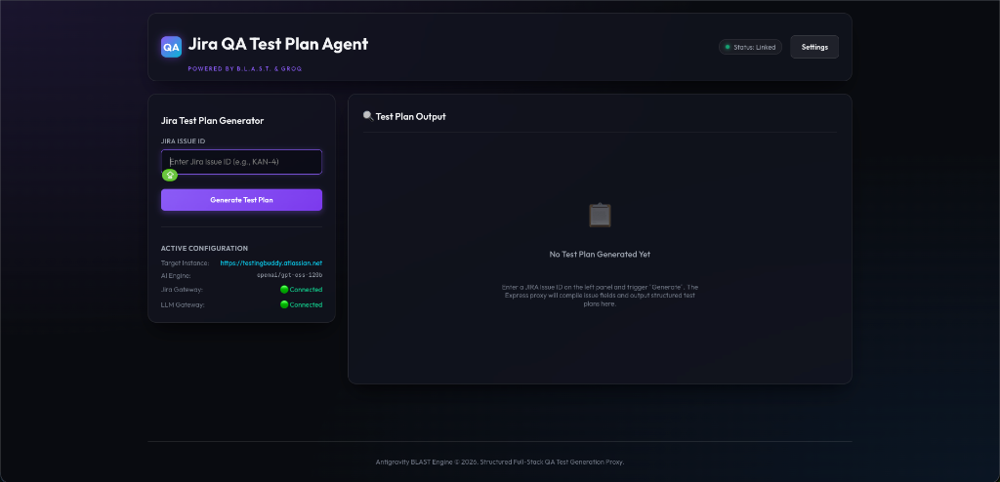
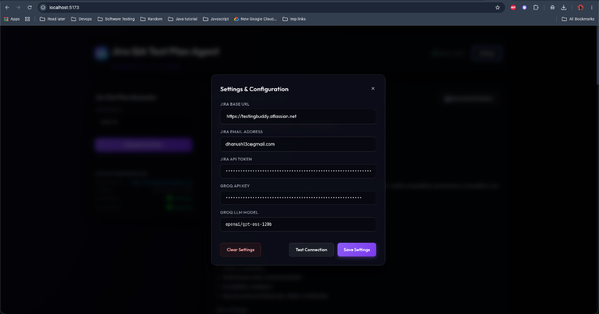
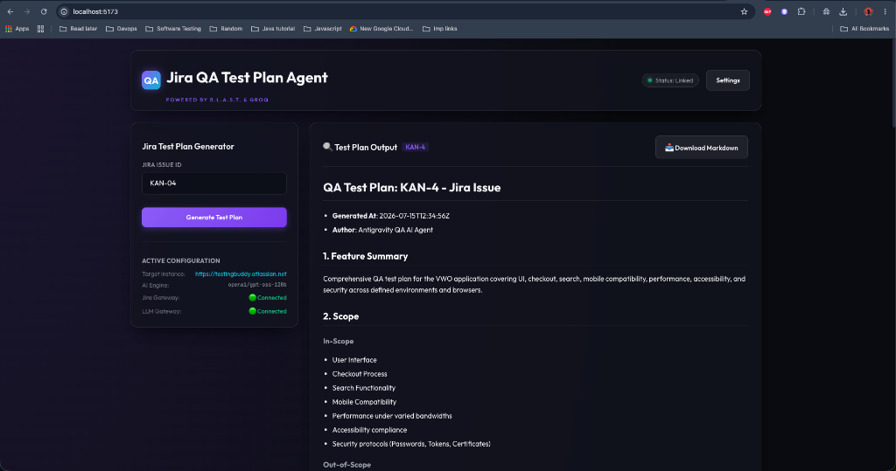

# 🔍 Jira QA Test Plan Generator

[](https://react.dev)
[](https://groq.com)
[](./docs/B.L.A.S.T.md)

A premium, full-stack QA automation companion designed to fetch JIRA issues on-demand, recursively normalize complex Atlassian Document Format (ADF) logs to clean text description parameters, and compile comprehensive, anti-hallucinatory QA Test Plans utilizing **B.L.A.S.T. framework** specifications and **Groq LLM completions**.

---

## 🗺️ Table of Contents
1. [System Summary](#-system-summary)
2. [Engineering Methodology](#️-engineering-methodology)
3. [Visual Walkthrough & Screenshots](#-visual-walkthrough--screenshots)
4. [Dashboard Evolution](#-dashboard-evolution-uiux-refinements)
5. [Directory Blueprint](#-directory-blueprint)
6. [Environment & Credentials Waterfall](#-environment--credentials-waterfall)
7. [Local Bootstrap Guide](#-local-bootstrap-guide)

---

## ⚡ System Summary
The application separates concerns across clear client and server boundaries:
* **Frontend Presentation**: A sleek, glassmorphic React single-page application built on Vite. It supports real-time API diagnostic status indicators, in-memory Settings credentials, a True Markdown preview engine, and single-click browser file downloads.
* **Backend Orchestration**: A zero-CORS Express proxy server listening on port `5001`. It secures token exchanges, routes diagnostic handshakes, flattens ADF fields, and connects to Groq API systems.
* **Anti-Hallucination Guardrails**: Powered by `openai/gpt-oss-120b` running at zero temperature. System prompt configurations force the AI to return `TBD` or document missing specification details inside a dedicated requirements gaps list rather than inventing features.

---

## 🛠️ Engineering Methodology

The Jira QA Test Plan Generator is built on a foundation of rigorous structural frameworks, combining prompt design with system engineering to deliver consistent, deterministic QA plans without LLM hallucinations.

| Framework | Core Focus | Implemented Application |
|:---|:---|:---|
| **RICE-POT** | **Prompt Engineering** | Governs how the LLM is instructed: adopts a strict QA Specialist **Role**, executes structured translation **Instructions**, binds strictly to the fetched ticket **Context**, runs under zero-temperature **Parameters**, compiles a deterministic JSON **Output**, and enforces a formal **Tone**. |
| **B.L.A.S.T.** | **System Architecture** | Governs how the application operates: isolates **Boundaries** via decoupled frontend/backend services, coordinates connection **Links** with real-time handshakes, renders **Assets** with a true Markdown preview pane, isolates **Storage** configuration states in memory, and triggers local **Triggers** concurrently. |

### The Deterministic, Zero-Hallucination Pipeline
By merging RICE-POT prompt guardrails with B.L.A.S.T. architectural constraints:
1. The **Context** (RICE-POT) is derived strictly from Normalized ADF fields retrieved via isolated **Boundaries** (B.L.A.S.T.).
2. The **Parameters** (RICE-POT) force the LLM to output "TBD" on data gaps instead of fabricating specs, while the **Assets** renderer (B.L.A.S.T.) compiles this information cleanly for visual analysis.
3. This synchronization completely removes the risk of "invented features" or "hallucinated API routes", ensuring that output plans are 100% traceable to the source ticket specifications.

---

## 📸 Visual Walkthrough & Screenshots

Below is a walkthrough of the premium dark-theme interface in action.

<details open>
<summary><b>1. Dashboard Interface (Initial State)</b></summary>
<br>

Features a clean input prompt and real-time active gateway metrics pointing out current connection health.


</details>

<details>
<summary><b>2. Settings & API Connection Handshake</b></summary>
<br>

Securely modify Jira instances, API tokens, and Groq endpoints. Triggers connections check tests updating status badges dynamically.


</details>

<details>
<summary><b>3. Compiled Test Plan Preview</b></summary>
<br>

Translates JSON plans into styled headers, list blocks, preconditions tables, and edge-case mitigation checklists.


</details>

---

## 🚀 Dashboard Evolution (UI/UX Refinements)

A chronological overview of visual and logic enhancements made:

* **Markdown Preview Engine**: Integrated the standard `react-markdown` compiler in the preview pane, eliminating regex-based parser bugs and supporting rich bold formatting, blocks, and lists.
* **Error Repositioning**: Moved narrow sidebar warning alerts into a wide, centered glassmorphic viewport panel inside the main result viewport.
* **Enterprise Copy Conventions**: Refactored developer shorthand parameters into enterprise terms: `Target Instance`, `AI Engine`, `Jira Gateway`, and `LLM Gateway`.
* **Stateful Connection Badges**: Leveraged emoji indicators and neon statuses (`🟢 Connected`, `🔴 Offline`, `🔴 Unauthenticated`, `🟡 Checking...`) for balanced interface health checks.
* **Reset Controllers**: Added an empty initial input state and a Settings Modal `"Clear Settings"` button to wipe form values without modifying local storage until saved.
* **Empty Bullet Filtering**: Implemented strict `.filter()` validations on arrays to eliminate blank checklist bullet formatting artifacts in HTML and exported files.

---

## 📂 Directory Blueprint

The project codebase follows a decoupled architectural layout:

```
04_jira_ai_agent/
├── backend/                             # Express Server Module
│   ├── server.js                        # Server routes, static serve, and API gateway routes
│   └── src/
│       └── services/                    # Core integrations
│           ├── jiraService.js           # Jira client, ADF flattening, and handshakes
│           ├── groqService.js           # Groq API diagnostic validation routines
│           └── testPlanService.js       # LLM system prompts and QA plan schema parsing
│
├── client/                              # Decoupled React Frontend Client (Vite)
│   ├── src/
│   │   ├── App.jsx                      # Main viewport layout, settings forms, and file export
│   │   └── index.css                    # Core design system and glassmorphic styling styles
│   └── vite.config.js                   # API proxy mapping /api to port 5001
│
├── docs/                                # Technical Specifications & Standard SOPs
│   ├── B.L.A.S.T.md                     # BLAST Framework Protocol specifications
│   ├── Objective.md                     # Design specs and North Star target outcomes
│   ├── prompt.md                        # LLM instruction system context details
│   ├── images/                          # Documentation screenshots
│   │   ├── dashboard_empty.png
│   │   ├── dashboard_output.png
│   │   └── settings_modal.png
│   └── architecture/
│       ├── jira_fetch_sop.md            # SOP: Jira credential flow & fetching schemas
│       └── test_plan_sop.md             # SOP: Anti-hallucination QA compilation SOP
│
├── output/                              # Target directory for local generated .md files
├── .env                                 # Local configuration credentials (Git ignored)
├── LLM.md                               # Project Constitution
├── findings.md                          # Engineering Discoveries & Learnings
├── progress.md                          # Incremental Progress Milestones Log
└── task_plan.md                         # Phase-wise Task Checklists
```

---

## 🔒 Environment & Credentials Waterfall

> [!IMPORTANT]
> The server maps authentication properties dynamically using a strict waterfall hierarchy:
> 1. **Header Overrides**: Passed live from browser Settings.
> 2. **Payload Overrides**: Passed in request bodies.
> 3. **Local Defaults**: Loaded fallback settings from the root `.env` file.

### Local Config Template (`.env`):
```ini
# Jira Cloud Configuration
JIRA_URL=https://<your-domain>.atlassian.net
JIRA_EMAIL=your-email@domain.com
JIRA_TOKEN=your-jira-api-token

# Groq LLM API Configuration
GROQ_KEY=gsk_your_groq_api_secret_key
GROQ_MODEL=openai/gpt-oss-120b
```

---

## 🏁 Local Bootstrap Guide

### 1. Installation
Run standard package installations inside the workspace root:
```bash
# Install backend and concurrency tools
npm install

# Install client packages (react-markdown, build assets)
npm run postinstall
```

### 2. Launching in Development Mode
Start both Express server and React client concurrently:
```bash
npm run dev
```
* Access the client dashboard directly at: [http://localhost:5173](http://localhost:5173)

### 3. Launching in Production Mode
Compile frontend static distribution pages:
```bash
npm run build
```
Launch the Express production server:
```bash
npm start
```
* Access the integrated application directly at: [http://localhost:5001](http://localhost:5001)

> [!TIP]
> To execute a direct command-line test plan fetch bypassing the UI, you can run:
> `node backend/src/services/testPlanService.js SAM1-6`
