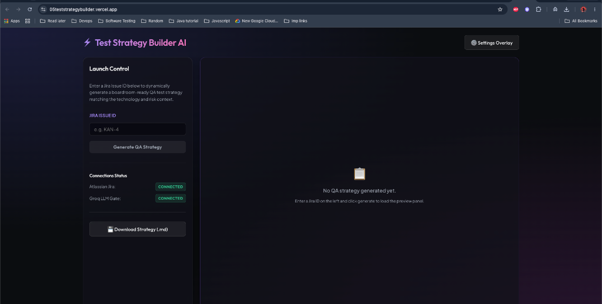
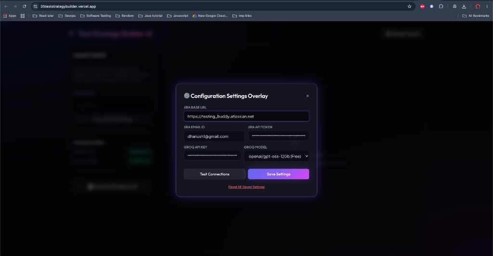
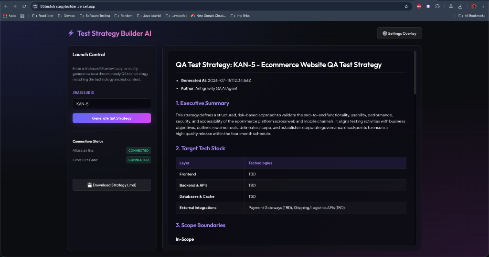
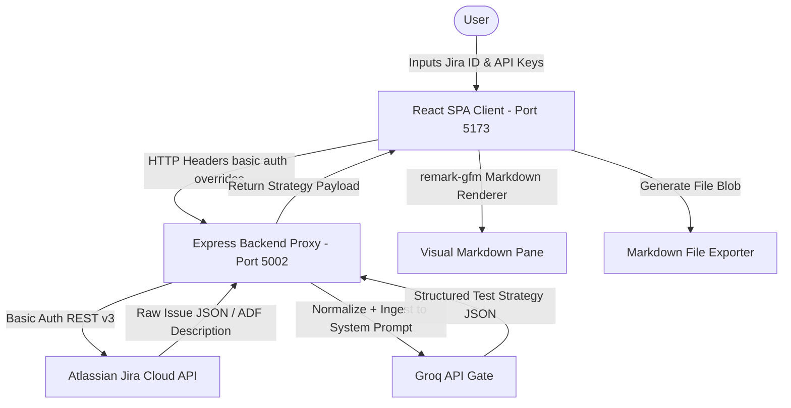

# Module 05 — Test Strategy Builder AI Agent

This module is an on-demand Atlassian Jira issue fetcher and boardroom-ready QA Test Strategy compiler. It is built using the **B.L.A.S.T. Framework** and configured in a decoupled full-stack React (Vite) + Node (Express) architecture.

---

## 🟢 Live Sandbox Deployment
The application is deployed live in production:
*   **Production Deployment URL:** [https://05teststrategybuilder.vercel.app](https://05teststrategybuilder.vercel.app)
*   **Hosting Target:** Vercel Cloud Serverless functions (`@vercel/node`) + Static Assets hosting.

---

## 📸 Application Dashboards

Below are screenshots demonstrating the interactive state panels, the settings overlay panel, and the generated strategy preview:

### 1. Welcome View (Initial State)


### 2. Configuration Settings Overlay Modal


### 3. Generated Test Strategy Preview (KAN-5)


---

## 🏗️ System Architecture & Workflow

The architecture decouples the React frontend (presentation) from the Express backend (proxy & integrations) to enforce strict boundary safety:



### Key Architectural Layers:
1.  **Vite React Frontend SPA (`client/`):** Consumes configurations (saved locally in client `localStorage` for privacy), triggers runs, parses returned strategy JSON payloads into structured markdown, and generates instant `.md` file downloads.
2.  **Express Backend Proxy (`server/`):** Acts as a CORS-free API gate. Normalizes rich text fields (flattening Atlassian Document Format ADF to plain text) and queries Groq completions API.
3.  **Groq SDK Pipeline (`openai/gpt-oss-120b`):** Consumes normalized ticket details under strict anti-hallucination prompting directives and outputs strategy files matching the JSON target contract.

---

## 🛠️ Local Installation & Launch Guide

### 1. Prerequisites
Ensure you have the following installed:
*   [Node.js](https://nodejs.org/) v18+ and npm.
*   Groq API Key (access to `openai/gpt-oss-120b`).
*   Atlassian Jira Cloud account (Jira base URL, user email, API token).

### 2. Scaffolding Local Keys
Copy the environmental variables template:
```bash
cp .env.example .env
```
Fill in the parameters inside `.env` (or configure them dynamically at runtime in the UI Settings overlay).

### 3. Dependency Installation
Install Node package managers at the module root (which automatically runs client post-installations):
```bash
npm install
```

### 4. Running the Dev Servers
Start the Express proxy backend and Vite frontend SPA concurrently:
```bash
npm run dev
```
*   **Vite Frontend Dev Server:** Running on [http://localhost:5173](http://localhost:5173)
*   **Express Proxy Server:** Running on [http://localhost:5002](http://localhost:5002)

---

## 📋 Interactive Status Badges

*   **Jira Cloud Connection Status:** 
    *   `Not Configured` or `Not Tested` (Grey/Amber indicator)
    *   `Connected` (Green indicator: verified endpoint and Basic Authentication header)
    *   `Failed: HTTP Status` (Red indicator: auth invalidation or bad domain)
*   **Groq API Gate Connection Status:**
    *   `Connected` (Green indicator: handshake check returned `"READY"`)
    *   `Failed` (Red indicator: key missing or expired)

---

## 📜 Boardroom-Ready Test Strategy Template

The strategy generator converts the structured LLM strategy JSON response into the following markdown blueprint:

```markdown
# QA Test Strategy: [JiraId] - [Strategy Title]

* **Generated At**: [ISO Date Timestamp]
* **Author**: Antigravity QA AI Agent

## 1. Executive Summary
[High-level summary of the QA mission and goals for this change]

## 2. Target Tech Stack
| Layer | Technologies |
| :--- | :--- |
| **Frontend** | [React/Vue/Swift, etc.] |
| **Backend & APIs** | [Node, Python, Go, etc.] |
| **Databases & Cache** | [PostgreSQL, Redis, etc.] |
| **External Integrations**| [Payment gateways, Webhooks, etc.] |

## 3. Scope Boundaries
### In-Scope
- [List of features included for verification]

### Out-of-Scope
- [Explicit architectural exclusions]

## 4. Test Levels & Methodology
| Level | Target Scope / Focus | Mapped Tools |
| :--- | :--- | :--- |
| **[Level]** | [Validation focuses] | [Jest, Playwright, Supertest, etc.] |

## 5. Risk & Mitigation Matrix
| Risk / Failure Mode | Impact | Likelihood | Quality Mitigation |
| :--- | :--- | :--- | :--- |
| [Potential architectural risk] | **[High/Med/Low]** | **[High/Med/Low]** | [Concrete automated/manual test mitigation] |

## 6. Enterprise Corporate Governance
### Compliance Requirements
- [SOC2 compliance tracking, HIPAA encryption, or WCAG accessibility targets]

### Quality Gates
- [Criteria for promotion to staging or production]

## 7. Gaps & Questions
- [Requirement ambiguities or TBDs compiled under anti-hallucination guardrails]
```
