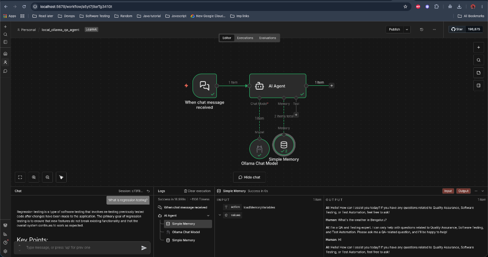
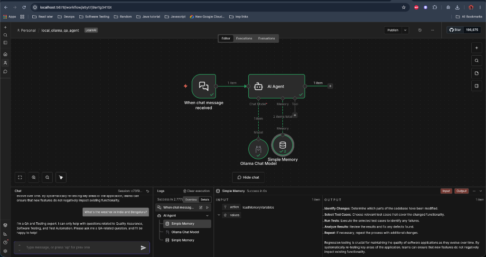
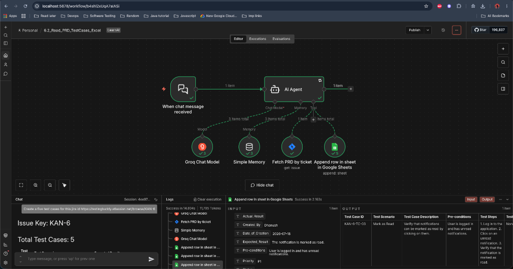
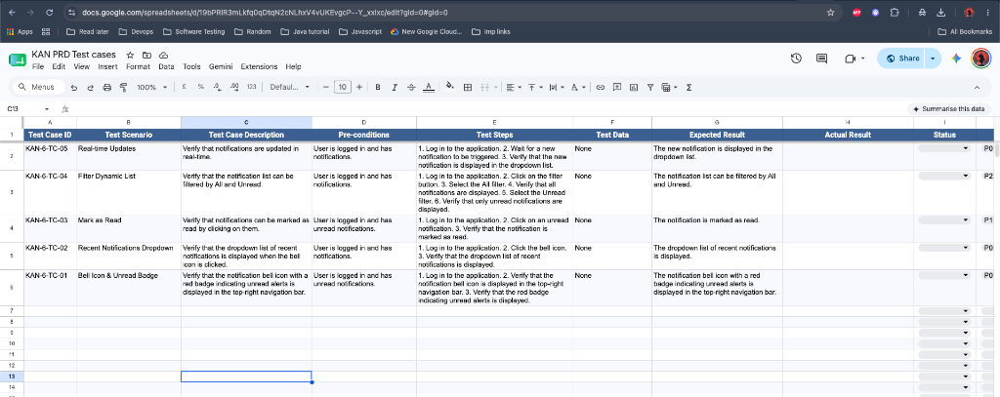
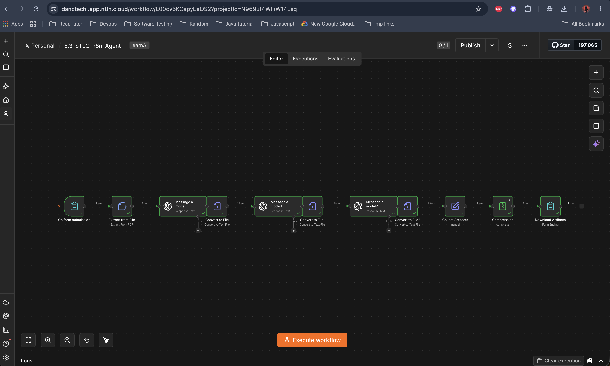
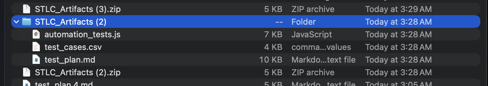

# n8n AI Orchestration Agents

> **3 automation blueprints** for Software Testing Life Cycle (STLC), powered by n8n, LangChain, and multi-LLM orchestration.

[](#-blueprint-catalog)
[](#1-local-ollama-qa-agent-61_local_ollama_qa_agentjson)
[](#2-jira-prd-to-google-sheets-test-case-generator-62_jira_prd_to_google_sheetsjson)
[](#3-stlc-artifact-generator-63_stlc_artifact_generatorjson)

---

## 📑 Table of Contents

<details open>
<summary><b>📋 All Workflows</b></summary>

| # | Workflow | LLM | Type | Status |
|---|----------|-----|------|--------|
| [1](##-1-local-ollama-qa-agent) | Local Ollama QA Agent | Ollama `qwen2.5-coder:7b` | Chat Agent |  |
| [2](##-2-jira-prd-to-google-sheets-test-case-generator) | Jira PRD → Google Sheets | Groq `llama-3.3-70b` | Tool Agent |  |
| [3](##-3-stlc-artifact-generator) | STLC Artifact Generator | OpenAI `llama-3.3-70b` | Pipeline |  |

</details>

---

## 🤖 Blueprint Catalog

---

<details>
<summary><h3>1. Local Ollama QA Agent</h3></summary>

**File:** `6.1_local_ollama_qa_agent.json`

| Attribute | Value |
|-----------|-------|
| **Identity** | Senior QA & Test Automation Expert (15+ yrs) |
| **LLM** | Ollama — `qwen2.5-coder:7b` |
| **Temp / Context** | `0` / `8192` tokens |
| **Memory** | Sliding Window Buffer |
| **Guardrail** | Anti-apology enforcement — out-of-scope queries get a fixed refusal string instead of conversational filler |

<details>
<summary><b>📊 Execution & Guardrail Proofs</b></summary>

###### Out-of-Scope Interception


###### In-Scope Domain Response


</details>
</details>

---

<details>
<summary><h3>2. Jira PRD to Google Sheets Test Case Generator</h3></summary>

**File:** `6.2_jira_prd_to_google_sheets.json`

| Attribute | Value |
|-----------|-------|
| **Identity** | Senior QA Automation Architect |
| **LLM** | Groq Cloud — `llama-3.3-70b-versatile` |
| **Memory** | Sliding Window Buffer |
| **Integrations** | Jira (read), Google Sheets (write) |
| **Spreadsheet** | [KAN PRD Test Cases](https://docs.google.com/spreadsheets/d/19bPRiR3mLkfq0qDtqN2cNLhxV4vUKEvgcP--Y_xxlxc/edit?usp=sharing) |

**Mandatory 5-Phase Workflow:**

```
Phase 1: Extract Jira key from chat
       ↓
Phase 2: Fetch PRD from Jira
       ↓
Phase 3: Generate test cases via LLM
       ↓
Phase 4: Append rows to Google Sheets
       ↓
Phase 5: Return markdown summary to user
```

<details>
<summary><b>📊 Execution & Spreadsheet Proofs</b></summary>

###### n8n Workflow Trace


###### Google Sheets Output


</details>
</details>

---

<details>
<summary><h3>3. STLC Artifact Generator</h3></summary>

**File:** `6.3_stlc_artifact_generator.json`

| Attribute | Value |
|-----------|-------|
| **Identity** | Multi-stage STLC pipeline |
| **LLM** | OpenAI-compatible — `llama-3.3-70b-versatile` |
| **Trigger** | Web form with PDF upload |
| **Memory** | Stateless (linear DAG) |
| **Delivery** | `STLC_Artifacts.zip` download |

**Pipeline Stages:**

```
[Form] → [Extract PDF] → [Generate Test Plan] → [Generate Test Cases] → [Generate Playwright Scripts] → [Zip] → [Download]
```

| Stage | Role | Prompt | Output |
|-------|------|--------|--------|
| 1 | QA Manager | Analyze PRD, produce Test Plan with Scope, Exclusions, Strategy, Risk | `test_plan.md` |
| 2 | QA Engineer | Generate CSV test cases from Test Plan (ID, Module, Steps, Priority) | `test_cases.csv` |
| 3 | Automation Engineer | Write Playwright JS using POM, `getByRole`, `expect` | `automation_tests.js` |

**Execution Run (VWO.com PRD):**

- **Input:** [VWO.com PRD PDF](outputs/Product_Requirements_Document_VWO.com.pdf)
- **Output:** [`outputs/6.3_stlc_artifacts/`](outputs/6.3_stlc_artifacts/)
  - `test_plan.md` — 10-section Test Plan
  - `test_cases.csv` — 16 test cases across 11 modules
  - `automation_tests.js` — POM Playwright scripts

<details>
<summary><b>📊 Execution Proofs</b></summary>

###### Form Upload


###### Artifact Download


</details>
</details>

---

## 🔧 Integration Matrix

| Integration | Workflow 1 | Workflow 2 | Workflow 3 |
|-------------|:---:|:---:|:---:|
| Ollama (local) | ✅ | ❌ | ❌ |
| Groq Cloud | ❌ | ✅ | ❌ |
| OpenAI (compat) | ❌ | ❌ | ✅ |
| Jira | ❌ | ✅ | ❌ |
| Google Sheets | ❌ | ✅ | ❌ |
| PDF Extraction | ❌ | ❌ | ✅ |
| File Download | ❌ | ❌ | ✅ |
